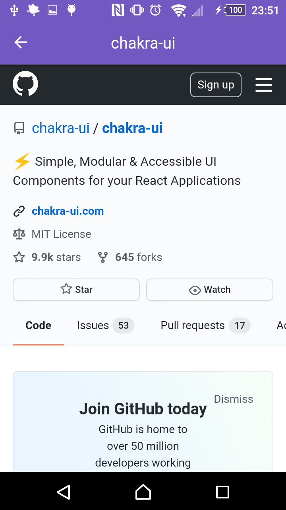

<h1 align="center" id="top">
    
</h1>

<h3 align="center">
  Código do desafio e das aulas do 6° módulo do   Bootcamp - Gostack
</h3>

“Só deseje as coisas as quais você está disposto a lutar”!

 

<h3 align="center">Mobile Introduction<h3>

  

  

  

  

  <a href="#dart-sobre">Sobre</a> &#xa0; | &#xa0;
  <a href="#rocket-tecnologias">Tecnologias</a> &#xa0; | &#xa0;
  <a href="#memo-licença">Licença</a> &#xa0; | &#xa0;
  <a href="https://github.com/maurodesouza" target="_blank">Autor</a>

 

## :dart: Sobre ##

Criar uma aplicação onde seja possível adicionar usuários do Github, listar os repositórios em que o usuário deu uma estrela, e ao clicar no repositório abrir uma página Web!

 

  
  
  

 

## :rocket: Tecnologias ##

As seguintes ferramentas foram usadas na construção do projeto:

- [React Native](https://reactnative.dev/)
- [React Navigation](https://reactnavigation.org/)
- [Styled Components](https://styled-components.com/)
- [Reactotron](https://infinite.red/reactotron)
- [Eslint](https://eslint.org/)

## :memo: Licença ##

Este projeto está sob licença MIT. Veja o arquivo [LICENSE](LICENSE.md) para mais detalhes.

Feito com :heart: por <a href="https://github.com/maurodesouza" target="_blank">Mauro de Souza</a>

&#xa0;

<a href="#top">Voltar para o topo</a>
